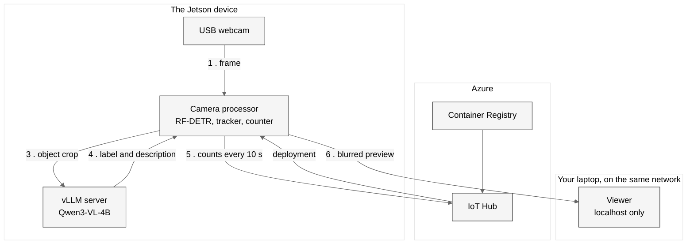
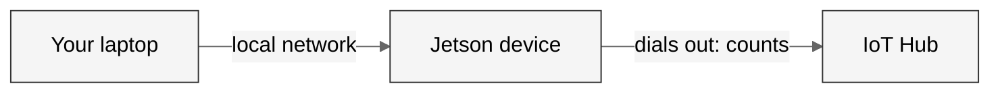

# AI on the Edge

Live camera analysis on an NVIDIA Jetson Orin Nano, with a detector and a
vision language model on the device.

> [!NOTE]
>
> This is a **demo project**. It shows that a small £250 computer can run a modern AI vision model on its own, with no internet connection.

> [!WARNING]
>
> This is a demonstration, **not a production ready solution**. Review and adjust it before using it anywhere real.

## The idea

A webcam looks at a scene: a road from a window, or an office. The device finds
every object of 80 everyday classes, follows each one, and counts each one when
it appears. A vision language model then looks at each new object. It corrects
the detector's label when it is wrong, and says what the object is, for
example *"white Royal Mail van"*.

All the analysis happens **on the device**. People are pixelated before any
picture leaves it. Azure receives only counts and timings.

You watch it work from a web page on your own laptop.

## The case for the edge

A common view is:

> *"Big AI models need big GPUs. Just send the pictures to the cloud."*

That is often true. But it breaks down when a camera runs **all the time**:

| Problem | Why it matters |
|---|---|
| **Cost** | You pay for every picture you send, for as long as the camera runs |
| **Delay** | A round trip to the cloud takes time |
| **Internet** | If the connection drops, the camera stops being useful |
| **Privacy** | A street camera records faces and number plates. That video should not leave the building |

Doing the work on the device solves all four.

**This is not an anti-cloud project.** Azure still builds the software, stores
it, delivers it and receives the results. It does not look at every frame.

## Architecture



1. The camera processor reads the newest frame from the webcam.
2. RF-DETR finds and counts the objects in each frame. A tracker gives each one an id.
3. For each new object, the processor keeps its best view and sends that crop to the vLLM server on the same device.
4. Qwen3-VL names and describes the object in about 3 seconds. The answer stays with the object's id.
5. The device sends the counts to IoT Hub every 10 seconds.
6. The device pixelates people and serves a preview on the local network. The viewer shows it.

**No picture leaves your network.** Azure receives only counts and timings.

## Models

| Model | Job | Speed on the Orin Nano | Licence |
|---|---|---|---|
| RF-DETR Small, on the GPU with CUDA | Finds objects in every frame | About 62 ms a frame, 10 to 13 frames a second | Apache 2.0 |
| Qwen3-VL-4B-Instruct, 4-bit AWQ | Names and describes what the detector found | About 3 seconds an answer | Apache 2.0 |

The detector cannot read the name on the side of a van. The VLM can, but it is
too slow to run on every frame. So the detector does the boxes, and the VLM
answers questions about the boxes.

Both models run on NVIDIA's software for Jetson. vLLM is NVIDIA's own build
for Orin. The Qwen3-VL checkpoint is the one NVIDIA test on the Orin Nano.

## Network access

Nothing is open to the internet.



The device **calls out** to IoT Hub, and sends only counts and timings. The
preview is open on port 8090 of the device, on your local network only. Do not
forward that port on your router.

## Hardware

| Item | Notes |
|---|---|
| NVIDIA Jetson Orin Nano Super Developer Kit (8 GB) | About £250 |
| USB webcam | Any normal one |
| NVMe SSD or microSD card | For the system, the images and the model |
| DisplayPort monitor, or an adapter | For the first setup only |

## Latency

Two different speeds matter here, and it is easy to mix them up:

| Speed | What it means | Is it the claim |
|---|---|---|
| **Device time** | How long the device takes to analyse a picture | **Yes** |
| **Viewing delay** | How long before the picture appears on your laptop | No. It depends on your network |

The viewer shows the device time.

## Repository layout

| Folder | Contents |
|---|---|
| `modules/vllm/` | The VLM server: NVIDIA's vLLM image and a start script |
| `modules/camera_processor/` | The camera pipeline: detection, tracking, counting, privacy, descriptions |
| `modules/viewer/` | The local web page. It runs on your laptop and reads the device over your network |
| `deployment/` | The IoT Edge manifest |
| `infra/` | The Azure resources, in Bicep |
| `scripts/` | Build and deploy scripts, for Windows and Linux |
| `.github/` | The CI workflow and the Dependabot configuration |

## Development

The same checks run on each commit and in CI. Install them one time:

```bash
pip install pre-commit==4.6.2
pre-commit install
```

The hooks run ruff to lint and format the Python code. They also check the
JSON, TOML and YAML files, the line ends, and that no private key is committed.
The [CI workflow](.github/workflows/ci.yml) runs the same hooks on each pull
request to `main`. It also runs the unit tests of the camera processor and the
viewer. Each module pins its Python packages in its own `pyproject.toml`.

## Status

The demo runs end to end on a Jetson Orin Nano Super with a USB webcam:

| Measure | Value |
|---|---|
| Detector, each frame | About 62 ms, 13 frames a second. About 10 while the VLM answers, because they share the GPU |
| One VLM answer, label and description | About 3 seconds |
| Camera module, restart to first frame | About 20 seconds |
| VLM server, start to ready | About 6 minutes |

Both images build in Azure. The camera pipeline has unit tests for the
detector output, the tracker, the counting, the privacy filter, the VLM answers
and the event log.

Setup steps, from Azure to a running demo: **[SETUP.md](SETUP.md)**
