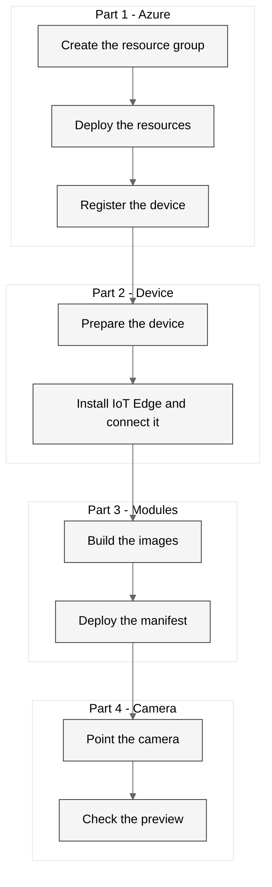

# Setup

This document tells you how to install and run the system.

You start with a Jetson Orin Nano that runs JetPack 7.2.1, and an Azure
subscription. When you complete all five parts, the device counts and describes
the traffic that a webcam sees. The device does not send the camera images to
the cloud.

Do the parts in order. Each part needs the part before it.

---

## Before you start

### The device

This document does not tell you how to install JetPack. Use NVIDIA's guides:

- [Getting started with Jetson](https://www.jetson-ai-lab.com/tutorials/getting-started-with-jetson/)
- [Orin Nano Developer Kit quick start](https://docs.nvidia.com/jetson/orin-nano-devkit/user-guide/latest/quick_start.html)

Before Part 1, the device must have:

| Item | Detail |
|---|---|
| Jetson Orin Nano Developer Kit | 8 GB, Super variant |
| JetPack | 7.2.1 (Jetson Linux R39.2.1). Check with `cat /etc/nv_tegra_release` |
| JetPack SDK components | `sudo apt-get install -y nvidia-jetpack`. The installer ISO does not include them |
| Storage | More than 30 GB free for the images and the model. An NVMe SSD is faster than a microSD card |
| Network | SSH access and a fixed IP address. Use a wired connection if you can |
| USB webcam | Any UVC camera |

### Your computer

You must have an Azure subscription. On the resource group, your account must
have the Owner role, or Contributor and User Access Administrator. The script
gives a service principal the AcrPull role, and Contributor cannot do this. In
Microsoft Entra ID, your account must be able to create app registrations.

| Software | Purpose |
|---|---|
| [Azure CLI](https://learn.microsoft.com/cli/azure/install-azure-cli) | Creates the Azure resources |
| `azure-iot` CLI extension | Registers the device |
| Git | The build script tags each image with a commit |
| PowerShell 7, on Windows | Runs the scripts in `scripts/windows` |
| `jq` and `envsubst`, on Linux or Mac | The scripts in `scripts/linux` use them |
| Python 3.10 or later | Runs the viewer |

---

## Procedure overview



1. **Part 1** creates the Azure resources. It also registers the device
   identity.
2. **Part 2** prepares the device. It then installs the IoT Edge runtime and
   connects the device to the hub.
3. **Part 3** builds the container images and starts them on the device.
4. **Part 4** points the camera at the scene.
5. **Part 5** shows the results on your computer.

---

## Part 1. Deploy the Azure resources

### 1.1 Sign in

```powershell
az login
az account set --subscription "<subscription-id>"
az extension add --name azure-iot
```

### 1.2 Choose a name

The registry and the IoT hub names must be unique in all of Azure, and every
resource name comes from `baseName` in `infra/src/main.bicepparam`. Change it
from `ai-on-edge` to a name of your own, for example `ai-edge-jsmith`. Use
lowercase letters, digits and hyphens, at most 46 characters. Without the
hyphens, it must have at least 2 characters, because the registry name is `acr`
and that.

### 1.3 Create the resource group

The script does not create the resource group. This is deliberate. The script
cannot then make resources in an unexpected place.

```powershell
az group create --name ai-on-edge-rg --location uksouth --tags workload=ai-on-edge
```

The location must agree with `infra/src/main.bicepparam`.

### 1.4 Deploy the resources

```powershell
.\scripts\windows\deploy_infra.ps1 -ResourceGroup ai-on-edge-rg
```

On Linux or Mac, use `./scripts/linux/deploy_infra.sh ai-on-edge-rg`.

The script deploys the Bicep template. It then registers an IoT Edge device
identity. It gets the secrets that the AVM modules do not give as outputs.
Last, it writes the `.env` file.

The hub refuses its shared access keys, so a leaked key cannot control the
device. The script gives you the IoT Hub Data Contributor role on the hub, and
the `az iot` commands in this guide sign in as you with `--auth-type login`. A
new role can take a few minutes to take effect. The script waits for it.

| Resource | Name | SKU | Purpose |
|---|---|---|---|
| IoT Hub | `iot-<baseName>` | S1 | Device identity, module deployment and telemetry |
| Container Registry | `acr<baseName>`, without hyphens | Basic | Holds the arm64 images |
| Log Analytics | `log-<baseName>` | Pay-as-you-go | The IoT Hub logs: device connections, deployments and errors |

The script writes the names to `.env`. In the commands in this guide,
`<hub-name>` is `IOT_HUB_NAME` and `<device-id>` is `IOT_DEVICE_ID`.

The deployment takes about ten minutes. The IoT Hub takes the most time.

#### Image delivery

The script makes an Entra service principal and gives it the **AcrPull** role on
this registry only. The device uses that principal to download the images.

The registry admin account stays off. That account works on the whole registry,
and it can push images and delete them. You cannot limit it. The service
principal can only download, and only from this one registry.

> [!NOTE]
> Many tenants limit how long a client secret can live. A common limit is 30
> days. The script asks for 29 days. Run the script again before the secret
> expires.

> [!WARNING]
> Each run of the script replaces the secret. The device keeps the old secret
> until the next deployment, and it cannot download an image with it. After
> each run of this script, do step 3.2 again.

A managed identity would remove the secret. The Jetson cannot use one, because
it has no Azure instance metadata service to get a token from.

> [!WARNING]
> The script replaces the `.env` file. Make a copy first if you added values by
> hand. The `.env` file holds secrets. Git ignores it. Do not commit it.

#### If the device registration fails

The script can deploy the resources correctly but stop at this step:

```
Failed to resolve '<hub-name>.azure-devices.net'
```

The deployment uses `management.azure.com`. The device registration uses the
hub name directly. Only the second one fails.

This is a name resolution problem on your computer, not a fault in Azure. Refer
to "The hub name does not resolve" in the "Common problems" section.

It is safe to run the script again after you correct it. The deployment is
idempotent. The script finds an existing device and does not make a second one.

### 1.5 Check the result

```powershell
az resource list --resource-group ai-on-edge-rg --query "[].{name:name, type:type}" -o table
az iot hub device-identity list --hub-name <hub-name> --auth-type login -o table
```

---

## Part 2. Connect the device to the IoT hub

Ubuntu 24.04 on ARM64 is a **Tier 1** platform for IoT Edge. Microsoft tests it.
JetPack 7 is therefore a supported host.

Use **IoT Edge 1.6 LTS**. Support for 1.5 ends in November 2026.

### 2.1 Prepare the device

The two models need most of the 8 GB of memory. Do these commands on the
device.

Set the maximum power mode, MAXN SUPER:

```bash
sudo nvpmodel -m 2
sudo nvpmodel -q
```

> [!WARNING]
> Check that SSH starts at boot before you stop the desktop. If it does not,
> you cannot get into the device after the next restart.

```bash
sudo systemctl enable ssh
```

> [!WARNING]
> Do the next step before you stop the desktop. A Wi-Fi connection that you make
> in the desktop keeps its password in your desktop keyring. Without the
> desktop, the device does not connect to the network at boot. You then cannot
> get into the device.

A wired connection needs no change. For Wi-Fi, find the name of the
connection:

```bash
nmcli -f NAME,TYPE,DEVICE connection show --active
```

Store the password in the system, and let the connection start for all users:

```bash
sudo nmcli connection modify "<name>" connection.permissions "" \
  wifi-sec.psk-flags 0 wifi-sec.psk "<wifi-password>" connection.autoconnect yes
```

Check the result. The command must show your Wi-Fi password:

```bash
sudo nmcli -s -g 802-11-wireless-security.psk connection show "<name>"
```

The desktop uses about 1.5 GB of memory. Stop it at boot:

```bash
sudo systemctl set-default multi-user.target
```

When vLLM starts, the two modules need more than the 7.3 GB of memory for a
short time. Swap on the SD card makes the start take about 11 minutes. Compressed
swap in memory, zram, makes it about 6 minutes. Add a 4 GB zram device in front
of the swap file, and make the kernel keep programs in memory:

```bash
sudo apt-get install -y systemd-zram-generator
printf '[zram0]\nzram-size = 4096\ncompression-algorithm = zstd\nswap-priority = 100\n' | sudo tee /etc/systemd/zram-generator.conf
echo 'vm.swappiness = 10' | sudo tee /etc/sysctl.d/90-ai-on-edge.conf
```

Restart the device:

```bash
sudo reboot
```

After the restart, `swapon --show` shows `/dev/zram0` with priority 100. From
your computer, connect to the device with SSH. This proves that the network
starts without the desktop.

To get the desktop back later, use
`sudo systemctl set-default graphical.target`.

### 2.2 Set the container runtime

JetPack 7 includes Docker and the NVIDIA Container Toolkit. You do not install
them.

> [!NOTE]
> Microsoft supplies `moby-engine` for IoT Edge. Microsoft supports Docker CE on
> a best-effort basis only. On the Jetson, `moby-engine` and the Docker from
> JetPack cause conflicts. Keep the Docker that JetPack supplies.

Both modules need the GPU. Make `nvidia` the default runtime:

```bash
sudo tee /etc/docker/daemon.json > /dev/null <<'EOF'
{
  "default-runtime": "nvidia",
  "runtimes": {
    "nvidia": {
      "path": "nvidia-container-runtime",
      "runtimeArgs": []
    }
  }
}
EOF
sudo systemctl restart docker
docker info | grep -i "default runtime"
```

### 2.3 Install the IoT Edge runtime

```bash
wget https://packages.microsoft.com/config/ubuntu/24.04/packages-microsoft-prod.deb -O packages-microsoft-prod.deb
sudo dpkg -i packages-microsoft-prod.deb
rm packages-microsoft-prod.deb

sudo apt-get update
sudo apt-get install -y aziot-edge
```

### 2.4 Give the device its identity

Get `IOT_DEVICE_CONNECTION_STRING` from the `.env` file on your computer.

```bash
sudo iotedge config mp --connection-string "<connection-string>"
sudo iotedge config apply
```

### 2.5 Check the runtime

```bash
sudo iotedge system status
sudo iotedge list
```

The `edgeAgent` module must run after one or two minutes. If it does not run,
read the logs:

```bash
sudo iotedge system logs -- -f
```

### 2.6 Test the path to the hub

The image builds in Part 3 take about 15 minutes. Prove first that the device
sends messages to the hub. Do these commands on your computer.

Apply the smoke-test manifest. It runs a public sample module that sends a
temperature reading every 5 seconds:

```powershell
az iot edge set-modules --hub-name <hub-name> --device-id <device-id> --content deployment/deployment.smoketest.json --auth-type login
```

After about a minute, the module log on the device shows each message it sends:

```bash
sudo iotedge logs SimulatedTemperatureSensor
```

Then check that the hub receives them. The count can take a few minutes to
show:

```powershell
$hub = az iot hub show --name <hub-name> --query id -o tsv
az monitor metrics list --resource $hub --metric d2c.telemetry.ingress.success --interval PT1M --aggregation Total -o table
```

The deployment in Part 3 replaces the sample module.

---

## Part 3. Build and deploy the modules

### 3.1 Build the images

> [!NOTE]
> Commit your changes first. The script tags each image with the last commit
> that changed its module folder. It stops if that folder has changes that are
> not committed.

```powershell
.\scripts\windows\build_modules.ps1
```

The build runs in ACR Tasks. ACR Tasks build arm64 images under emulation on
amd64 hosts. The images compile nothing, so emulation is enough. The script
skips an image that the registry already holds with its tag. Use `-Force` to
build it again.

| Image | Contents |
|---|---|
| `vllm` | NVIDIA's vLLM build for Jetson Orin and a start script. vLLM downloads the model on the first start |
| `camera-processor` | The camera pipeline, the RF-DETR detector as an ONNX file, and ONNX Runtime with CUDA |

Both images use the same NVIDIA base image, pinned by digest. The first build
pulls 8.5 GB of base layers, so it takes longer than the next builds.

To build one image only:

```powershell
.\scripts\windows\build_modules.ps1 -Module camera-processor
```

### 3.2 Deploy the modules

```powershell
.\scripts\windows\deploy_modules.ps1
```

The script finds the tag of each image in the same way as the build script. It
stops if the registry does not hold an image with that tag.

A module restarts only when its image tag changes. A change to the camera
module therefore does not restart `vllm`, which takes about 6 minutes to start.

The script puts the values from `.env` into
`deployment/deployment.template.json`. It then checks the result and sends it to
the device. Git ignores the completed manifest because it holds secrets. Git
keeps the template.

The check finds one failure that was difficult to diagnose before.
`createOptions` is JSON inside JSON. A bad value is still correct as part of the
manifest. The error showed only at `set-modules`. The script now reads each
`createOptions` value on its own and names the module in the error.

### 3.3 Watch the modules start

Do these commands on the device:

```bash
sudo iotedge list
sudo iotedge logs cameraprocessor -f
sudo iotedge logs vllm -f
```

The first start is slow:

1. The device downloads the images. The base layers are 8.5 GB, and the two
   images share them.
2. The `vllm` module downloads 4.4 GB of model weights to the `edge-models`
   volume. On a home connection this took 7 minutes.
3. The `vllm` module loads the model. This takes about 6 minutes with zram
   (step 2.1), and about 11 minutes without it.

The next starts skip steps 1 and 2. Detection and counting start before `vllm`
is ready.

| Module | Log line | Meaning |
|---|---|---|
| `cameraprocessor` | `detector rf-detr-small on CUDAExecutionProvider` | The detector runs on the GPU |
| `cameraprocessor` | `waiting for vLLM; detection and counting carry on without it` | Correct while `vllm` loads |
| `cameraprocessor` | `vLLM is ready; the judge is on` | The VLM descriptions start |
| `vllm` | `Application startup complete` | The VLM server is ready |

> [!WARNING]
> If the log shows `detector is on the CPU`, the container has no GPU. Do step
> 2.2 again, and check `"Runtime": "nvidia"` in the manifest.

### 3.4 Check the preview

On the same network as the device, open `http://<device-ip>:8090/stream` in a
browser. You see the camera picture with a box and a label on each object.

---

## Part 4. Point the camera

> [!WARNING]
> A public road shows people. Under UK GDPR, their images are personal data. The
> module pixelates people before a picture leaves the device. It keeps no
> recording and does not read number plates. Do not change these behaviours.

The module works on any scene: a road, an office or a desk. It has no settings
to change for each scene.

For a road through a window:

1. Put the webcam flat against the window glass.
2. Hang a dark cloth behind the webcam. The cloth stops reflections of the room.
3. Point the camera down and across the road. Traffic that comes straight at
   the camera hides the vehicles behind it.
4. Open the preview at `http://<device-ip>:8090/stream`.
5. Make sure each vehicle is fully in view for a part of its path.

The module counts each object one time when it appears. The detection
behaviour is in [deployment/README.md](deployment/README.md).

---

## Part 5. Show the results

The viewer runs on your computer. It reads the device over your local network.
It needs only Python 3.10 or later, with no packages.

```powershell
cd modules\viewer
pip install -e .
python -m viewer --device <device-ip>
```

The viewer opens <http://localhost:8080> in your browser. It shows the picture,
the objects in view, the objects seen since start, the VLM descriptions, and the
detections of this session. Click a detection to see its frame.

> [!NOTE]
> The pictures do not go to Azure. Your computer must be on the same network as
> the device.

The counts also go to IoT Hub every 10 seconds. The module log on the device
shows each message, and the `d2c.telemetry.ingress.success` metric in step 2.6
counts them on the hub:

```bash
sudo iotedge logs cameraprocessor | grep telemetry
```

---

## Common problems

| Symptom | Cause | Correction |
|---|---|---|
| `Failed to resolve ...azure-devices.net` | Your network sends this domain to a different DNS server | Refer to "The hub name does not resolve" below |
| Bicep gives error BCP259 | `main.bicepparam` does not agree with the template | Run `az bicep build-params --file main.bicepparam` |
| The modules do not start | IoT Edge cannot download from the registry | Check the registry credentials in `.env`. The secret expires after 29 days |
| The log says `detector is on the CPU` | The container has no GPU | Do step 2.2. Check `"Runtime": "nvidia"` in the manifest |
| The preview shows no picture, and the `cameraprocessor` log says `no camera` | No webcam gives frames | Connect the webcam. Then run `ls /dev/video*` on the device. The module finds the webcam within 2 seconds, with no restart |
| `vllm` stops with an out-of-memory error | The two models and the desktop do not fit in 8 GB together | Do step 2.1. Then make `VLLM_KV_CACHE_BYTES` smaller in the manifest |
| `vllm` takes more than 5 minutes to start | Memory goes to swap on the SD card | Do the zram part of step 2.1. Check with `swapon --show` |
| No descriptions | `vllm` is not ready, or no object is large enough | Read the `cameraprocessor` log. The VLM gets objects of 64 pixels or more on the short side |
| `nvcc: command not found` | The JetPack SDK components are not installed | Install `nvidia-jetpack`. Refer to "Before you start" |
| The device does not connect to the network after a restart | The network cable is out, or the Wi-Fi password is in the desktop keyring and the desktop does not start | Check the cable and the port lights first. For Wi-Fi, connect a monitor and a keyboard, then do the Wi-Fi step in 2.1 |
| `edgeAgent` logs `pull image ... StatusCode:401`, and the modules do not start | The registry secret changed after the last deployment | Do step 3.2 again. It gives the device the secret in `.env` |

### Device connection check

The portal and `az iot hub module-twin show` show the module status that the
device reported last. A device that has lost its network still shows its
modules as running. Read the connection state of the device instead:

```powershell
az iot hub device-identity show --hub-name <hub-name> --device-id <device-id> --auth-type login --query connectionState -o tsv
```

To see when the device was connected, read the hub's connected device count:

```powershell
$hub = az iot hub show --name <hub-name> --query id -o tsv
az monitor metrics list --resource $hub --metric connectedDeviceCount --interval PT5M --aggregation Maximum -o table
```

### The hub name does not resolve

Some corporate networks use a split-DNS policy. The policy sends a domain such
as `azure-devices.net` to an internal DNS server. If you are not on the company
VPN, that server does not answer. The name then fails, but a public DNS server
can still resolve it.

To find out if this is the cause, compare the two paths:

```powershell
nslookup <hub-name>.azure-devices.net 8.8.8.8
[System.Net.Dns]::GetHostAddresses('<hub-name>.azure-devices.net')
```

If the first command works and the second fails, your computer uses a different
DNS server for this domain. On Windows, you can see the rules:

```powershell
Get-DnsClientNrptPolicy | Where-Object { $_.Namespace -like '*azure-devices*' }
```

Connect to the company VPN to correct this.

### The hub refuses the connection

An IoT Hub with `publicNetworkAccess` set to `Disabled` and no private endpoint
is not available from anywhere. Check the value:

```powershell
az iot hub show --name <hub-name> --query "properties.publicNetworkAccess" -o tsv
```

The Bicep template sets this to `Enabled`. The device connects outbound over the
public internet.

---

## Costs

| Resource | SKU | Cost each month |
|---|---|---|
| IoT Hub | S1 | About £20 |
| Container Registry | Basic | About £4 |
| Log Analytics | Pay-as-you-go | Less than £1 for the IoT Hub logs of one device |

The IoT Hub has a free F1 tier. It permits 8,000 messages each day. You can have
one F1 hub for each subscription. The device sends one message each 10 seconds,
which is 8,640 each day. Set `TELEMETRY_INTERVAL_S` to 15 or more in the manifest
to stay in F1. Then change `iotHubSku` in `main.bicepparam`.

To stop all costs, delete the resource group:

```powershell
az group delete --name ai-on-edge-rg --yes --no-wait
```

---

## Related documents

| Document | Contents |
|---|---|
| [infra/README.md](infra/README.md) | The resources that Bicep deploys |
| [scripts/README.md](scripts/README.md) | The function of each script |
| [deployment/README.md](deployment/README.md) | The manifest template |
