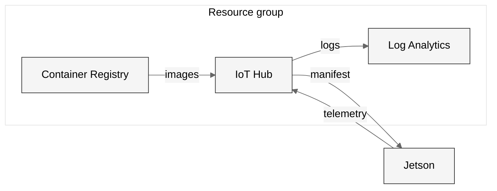

# Infrastructure

The Azure resources for the demo. One Bicep template, built only from Azure
Verified Modules.

## Resources



1. ACR Tasks build the module images and keep them in the Container Registry.
2. IoT Hub sends the deployment manifest to the device.
3. The device pulls the images with a service principal that has only AcrPull.
4. The device sends counts and health telemetry to IoT Hub every 10 seconds.
5. IoT Hub sends its own logs to Log Analytics. The logs show when the device connects and disconnects.

No picture goes to Azure. The preview stays on the local network.

| Resource | Name | Purpose |
|---|---|---|
| IoT Hub | `iot-<baseName>` | Device identity, module deployment, telemetry |
| Container Registry | `acr<baseName>` | The arm64 module images. The admin account is off |
| Log Analytics | `log-<baseName>` | The IoT Hub logs and metrics |

## Parameters

Set these in `src/main.bicepparam`.

| Parameter | Default | Purpose |
|---|---|---|
| `baseName` | none | The prefix for every resource name. Change it: the registry and IoT hub names must be unique in all of Azure |
| `location` | the resource group location | The Azure region |
| `iotHubSku` | `S1` | The IoT Hub tier |
| `acrSku` | `Basic` | The registry tier |
| `telemetryRetentionDays` | `30` | Days to keep the IoT Hub logs |
| `deployerPrincipalId` | none | The object id that gets IoT Hub Data Contributor. The deploy script sets it to whoever runs it |
| `deployerPrincipalType` | `User` | `User` or `ServicePrincipal`. The deploy script sets it |

## Deployment

Do not deploy the template by hand. Run `scripts/windows/deploy_infra.ps1` or
`scripts/linux/deploy_infra.sh`. The script also registers the device, creates
the AcrPull service principal and writes the `.env` file. See
[scripts/README.md](../scripts/README.md).

> [!WARNING]
> The IoT Hub module overrides three Azure Verified Module defaults:
> `publicNetworkAccess`, `disableDeviceSAS` and `disableModuleSAS`. IoT Edge
> cannot connect without all three. Do not remove one of them because the device
> error names a different one, `disableLocalAuth`.

`disableLocalAuth` keeps its default, `true`. The hub refuses its hub-wide
shared access keys, such as `iothubowner`, which can deploy any container to the
device. People and scripts sign in with Entra ID instead: the template gives
`deployerPrincipalId` the IoT Hub Data Contributor role on the hub. The device
and module keys stay on, because IoT Edge cannot use Entra ID. One effect: the
built-in Event Hubs endpoint takes keys only, so `az iot hub monitor-events`
does not work.

## Validation

Build the template and the parameter file before a deployment:

```powershell
az bicep build --file src/main.bicep
az bicep build-params --file src/main.bicepparam
```

The second command finds parameters that the template no longer declares.
The first command does not.
