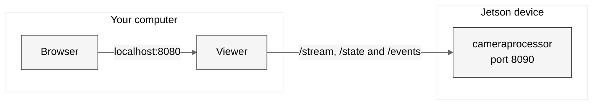

# Viewer

A web page for the camera module. It runs on your computer and reads the
device over your local network. No picture goes to Azure.

The page fits one screen. It shows:

- the annotated picture from the device
- the detector time, the frame rate, the objects in view and the number of VLM answers
- the number of corrections, and the newest one, such as "motorcycle → bicycle"
- the objects in view now, and the objects seen since start, for each class
- the detections of this session, one row for each object

A row appears when an object appears. Until the VLM answers, the row says what
happens to the object now: too small for the VLM, at the frame edge, waiting for
the VLM, or out of view. When the VLM answers, the row shows its description.
If the object leaves without a description, the row gives the reason. If the
VLM corrected the detector's label, the row has an amber
edge and shows the detector's label. The **Corrected** filter shows only these
rows. A person is pixelated in the picture, but the VLM describes it from the
original crop on the device. Click a row to see its frame, with
the object marked in white. The list is in memory only. It is gone when you stop
the viewer. When the device restarts, its counts start again at zero, and the
list starts again with them. **Clear** empties the list at any time. The
events the device still holds do not come back; only new ones appear.

The page uses a light or a dark theme. It follows the setting of your
operating system.

## Start the viewer

Python 3.10 or later is necessary. The viewer uses only the standard library.

```powershell
cd modules\viewer
pip install -e .
python -m viewer --device 192.168.0.143
```

The viewer opens <http://localhost:8080> in your browser.

| Setting | Flag or variable | Default |
|---|---|---|
| Device address | `--device` or `VIEWER_DEVICE` | None. Give the IP address or name of the device |
| Listen address | `VIEWER_HOST` | `127.0.0.1` |
| Listen port | `VIEWER_PORT` | `8080` |
| Do not open a browser | `--no-browser` | Off |

## Architecture



1. The browser loads the page from the viewer.
2. The viewer holds one connection to `/stream` on the device. If the device stops, the viewer connects again. The browser keeps its own connection, so the picture does not freeze.
3. The page asks for `/state` two times a second. The viewer relays it from the device.
4. The viewer asks the device for new `/events` each second, and copies each event with its frame. The device keeps only its last 100 events, so the viewer holds the session history. It keeps the last 1000. When the device reports a new session, the viewer deletes the history of the old session.
5. **Clear** sends `POST /history/clear` with the page's `X-Viewer-Session` header. Without the header the viewer refuses the request, so another web page in the same browser cannot clear the history.

The viewer listens on `127.0.0.1` only. Other computers cannot connect to it.

## Tests

The tests need pip 25.1 or later. They do not need a device.

```bash
cd modules/viewer
pip install --group test
python -m pytest
```
